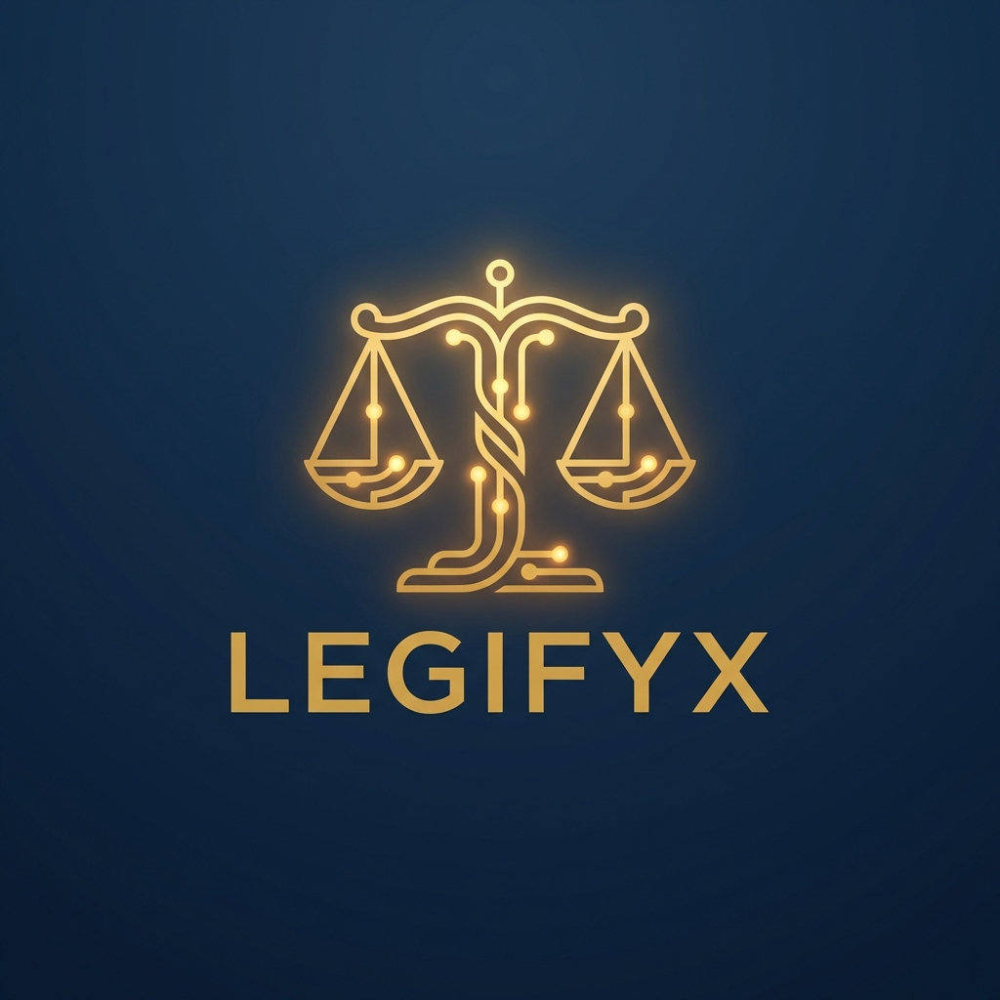

# ⚖️ LEGIFYX - AI-Powered Legal Contract Analysis Bot

<div align="center">



**AI-Powered Legal Assistant for Indian SMEs**

[](https://python.org)
[](https://streamlit.io)
[]()
[]()

*Empowering SME owners to understand complex contracts, identify legal risks, and receive actionable advice in plain language.*

[🚀 Quick Start](#-quick-start) • [✨ Features](#-features) • [♿ Accessibility](#-accessibility) • [📖 Documentation](#-documentation)

</div>

---

## 🎯 What is Legifyx?

**Legifyx** is a sophisticated GenAI-powered legal contract analysis bot designed specifically for Indian Small and Medium Enterprises (SMEs). It helps business owners:

- 📄 **Understand** complex legal documents in simple, plain language
- 🚨 **Identify** hidden risks and unfavorable terms before signing
- 💡 **Receive** actionable recommendations for contract improvements
- 🔒 **Ensure** compliance with Indian laws and regulations
- ♿ **Access** full voice navigation for visually impaired users

---

## ✨ Features

### 📊 Contract Analysis
| Feature | Description |
|---------|-------------|
| **Contract Classification** | Automatically identifies contract type (Employment, Vendor, Lease, NDA, etc.) |
| **Clause Extraction** | Extracts and categorizes individual clauses and sub-clauses |
| **Entity Recognition** | Identifies parties, dates, amounts, jurisdictions, and key terms |
| **Obligation Detection** | Distinguishes between obligations, rights, and prohibitions |

### 🚨 Risk Assessment
| Feature | Description |
|---------|-------------|
| **Clause-Level Scoring** | Rates each clause 1-10 for risk |
| **Contract-Level Score** | Composite risk score for the entire document |
| **Critical Clause Detection** | Identifies penalty, indemnity, termination, arbitration clauses |
| **Compliance Checking** | Verifies against Indian Contract Act, IT Act, and more |

### 🌐 Multilingual Support
- **English** (Primary)
- **Hindi** हिंदी
- **Tamil** தமிழ்
- **Telugu** తెలుగు
- **Kannada** ಕನ್ನಡ
- **Malayalam** മലയാളം
- **Marathi** मराठी
- **Gujarati** ગુજરાતી
- **Bengali** বাংলা
- **Punjabi** ਪੰਜਾਬੀ

### ♿ Accessibility Features
**Designed with visually impaired users in mind:**
- 🔊 **Voice Navigation** - Navigate the entire application using voice cues
- 📖 **Auto-Read Results** - Automatically speaks analysis findings
- 🎤 **Text-to-Speech** - Hear any content read aloud
- 🔆 **High Contrast Mode** - Enhanced visibility options
- 🔤 **Large Text Mode** - Increased font sizes

### 📤 Export Options
- **PDF Reports** - Professional, branded analysis reports
- **JSON Data** - Structured data for integration
- **Audio Summaries** - MP3 audio files of contract summaries

### 🔒 Security & Privacy
- **AES-256 Encryption** - All documents encrypted at rest
- **Audit Logging** - Complete trail of all actions
- **Secure Deletion** - Proper cleanup of temporary files
- **No Data Storage** - Documents not retained after analysis

---

## 🚀 Quick Start

### Prerequisites
- Python 3.9 - 3.12
- Windows / Linux / macOS
- [Tesseract OCR](https://github.com/UB-Mannheim/tesseract/wiki) (optional, for image processing)

### Installation

```bash
# Clone the repository
git clone https://github.com/yourusername/legifyx.git
cd legifyx

# Create virtual environment
python -m venv venv

# Activate virtual environment
# Windows:
.\venv\Scripts\activate
# Linux/Mac:
source venv/bin/activate

# Install dependencies
pip install -r requirements.txt

# Download NLP models
python -m spacy download en_core_web_sm
```

### Running the Application

```bash
# Windows
run_legifyx.bat

# OR directly
streamlit run app.py --server.port 8501
```

Open your browser and navigate to: **http://localhost:8501**

---

## 📁 Project Structure

```
legifyx/
├── app.py                          # Main Streamlit application
├── setup.py                        # Setup and initialization script
├── requirements.txt                # Python dependencies
├── run_legifyx.bat                 # Windows launcher
├── run_legifyx.sh                  # Linux/Mac launcher
│
├── config/
│   └── settings.py                 # Application configuration
│
├── core/
│   ├── analyzer.py                 # Contract analysis orchestrator
│   ├── nlp_engine.py               # NLP processing engine
│   ├── risk_scorer.py              # Risk assessment module
│   └── entity_extractor.py         # Named entity extraction
│
├── services/
│   ├── document_parser.py          # PDF, DOCX, TXT parsing
│   ├── ocr_service.py              # Image OCR processing
│   ├── translation.py              # Multilingual translation
│   ├── tts_service.py              # Text-to-speech accessibility
│   └── notification_service.py     # Real-time notifications
│
├── templates/
│   ├── clause_templates.py         # Standard clause templates
│   └── contract_templates/         # Full contract templates
│
├── utils/
│   ├── pdf_generator.py            # PDF report generation
│   ├── audit_logger.py             # Audit trail logging
│   └── encryption.py               # Data encryption utilities
│
├── data/
│   └── knowledge_base.py           # SME knowledge base
│
├── assets/
│   └── logo.png                    # Legifyx brand logo
│
└── samples/
    └── sample_service_agreement.txt # Sample contract for testing
```

---

## ♿ Accessibility Mode

Legifyx is designed to be fully accessible for visually impaired users:

### Enabling Accessibility Mode
1. Open the sidebar (☰ icon)
2. Check **"🔊 Enable Accessibility Mode"**
3. Configure additional options:
   - **Voice Navigation** - Hear navigation announcements
   - **Auto-Read Results** - Automatically read analysis findings
   - **Voice Speed** - Adjust speech rate (100-250)
   - **High Contrast Mode** - Enhanced color contrast
   - **Large Text Mode** - Increased font sizes

### Voice Commands
Throughout the application, look for **🎤 Voice** buttons to:
- Hear page descriptions
- Listen to analysis results
- Navigate sections
- Download audio summaries

---

## 🛡️ Compliance & Legal Framework

Legifyx checks contracts against key Indian legal frameworks:

| Law/Regulation | Coverage |
|----------------|----------|
| **Indian Contract Act, 1872** | Contract validity, enforceability |
| **Arbitration and Conciliation Act, 1996** | Dispute resolution clauses |
| **Indian Stamp Act** | Stamp duty requirements |
| **Registration Act, 1908** | Registration requirements |
| **Information Technology Act, 2000** | E-contracts, digital signatures |
| **Consumer Protection Act, 2019** | Consumer contract terms |

---

## 📋 Supported File Formats

| Format | Extension | Description |
|--------|-----------|-------------|
| PDF | `.pdf` | Standard PDF documents |
| Word | `.docx`, `.doc` | Microsoft Word documents |
| Text | `.txt` | Plain text files |
| Images | `.jpg`, `.jpeg`, `.png` | Scanned documents (OCR) |

---

## 🔧 Configuration

Copy `.env.example` to `.env` and customize:

```env
# Application Settings
APP_ENV=production
DEBUG=false

# OCR Settings (if Tesseract not in PATH)
TESSERACT_PATH=C:\Program Files\Tesseract-OCR\tesseract.exe

# Security
ENCRYPTION_ENABLED=true
AUDIT_LOGGING=true

# File Limits
MAX_FILE_SIZE_MB=50
```

---

## 🤝 Contributing

We welcome contributions! Please see our [Contributing Guidelines](CONTRIBUTING.md) for details.

---

## 📄 License

This project is proprietary software. Unauthorized copying, modification, or distribution is prohibited.

---

## 🙏 Acknowledgments

- **spaCy** - Industrial-strength NLP
- **NLTK** - Natural Language Toolkit
- **Streamlit** - Beautiful web applications
- **ReportLab** - PDF generation

---

## 📞 Support

For support, please contact:
- 📧 Email: support@legifyx.com
- 📱 Phone: +91-XXX-XXX-XXXX

---

<div align="center">

**Made with ❤️ for Indian SMEs**

⚖️ **LEGIFYX** - *Simplifying Legal Complexity*

</div>
